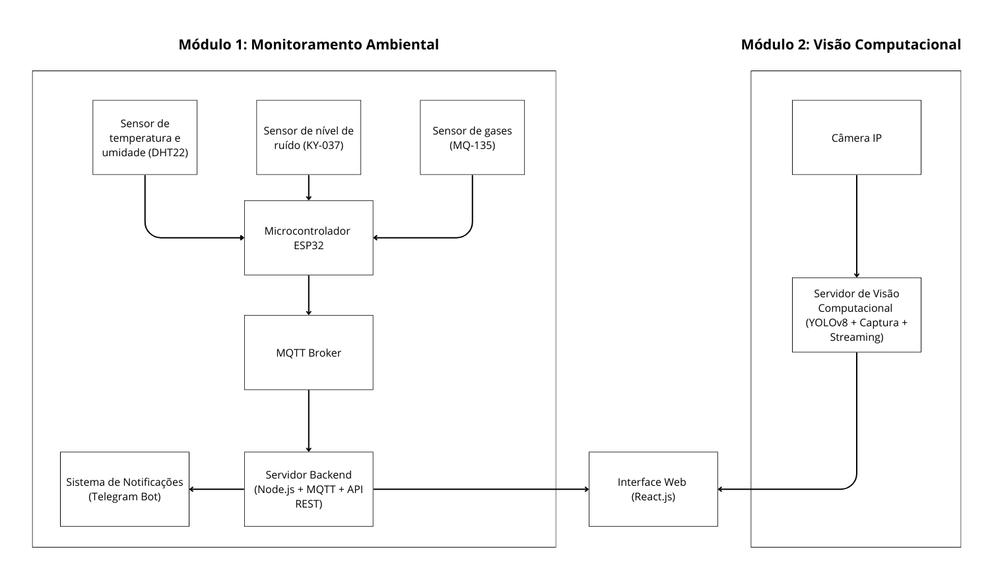

# 🛡️ Sistema de Monitoramento de Segurança Industrial

Este projeto tem como objetivo monitorar, em tempo real, a segurança em ambientes industriais através de sensores físicos ligados a um ESP32 e visão computacional com YOLOv8. O sistema emite alertas quando há condições ambientais críticas ou ausência de EPIs (capacete, máscara, luvas e protetor auricular).

## 📦 Componentes do Projeto

- **📡 Backend (Node.js)**: recebe dados via MQTT, processa alertas e envia mensagens para o Telegram.
- **👁️ Visão Computacional (Python)**: detecta violações de EPI usando YOLOv8.
- **🖥️ Frontend (React/Vite)**: dashboard web para visualização dos dados e vídeo ao vivo.
- **🔧 Código ESP32**: coleta e compartilha dados de sensores de temperatura, ruído, umidade e gás.

### 🧭 Arquitetura do sistema

